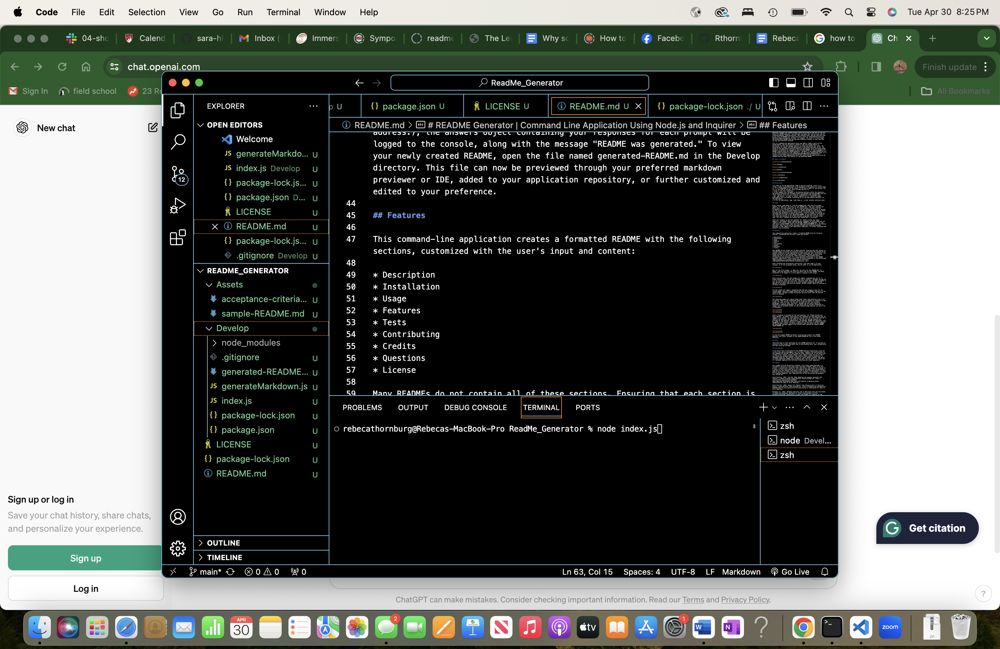
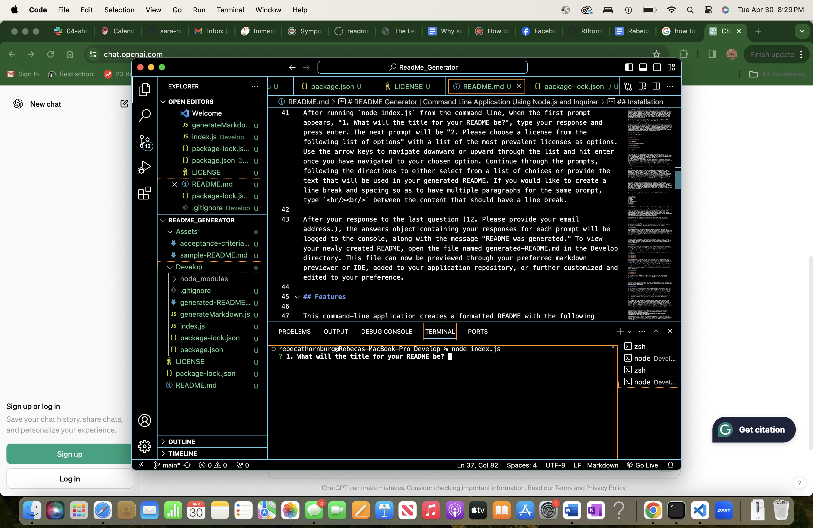

# README Generator | Command Line Application Using Node.js and Inquirer

## Description

This project is a professional README generator designed to help easily generate a README for an application repository based on user input. READMEs are an essential part of any repository, helping viewers understand the purpose, function, and features of the project, as well as showcasing the developer's work to potential future employers and collaborators. However, creating a comprehensive, well-designed README can be time consuming, and many developers would prefer to focus their time on developing interesting features for their project. This README generator helps to: quickly generate the README's structure; automate markdown formatting; and guide the user through the process to reduce the work necessary for a high quality README. 

The README generator automatically adds all of the sections generally necessary for a comprehensive, professional README, with a Table of Contents that navigates to the appropriate README section on click. A license badge, a link to view the license, a link to the user's GitHub account, and the entire License and Questions sections are created without requiring writing on the part of the user. Using this README generator, the developer can spend less time on tasks such as creating headings, ordering sections, and creating links, and the time that they do put into the README will likely have more return on investment—writing more detailed Usage and Features Sections, for example. The result is a more robust and professional README than you may have otherwise created, in less time than you may have otherwise invested. 

This is a command-line application which uses Node.js (Node's built-in File System module, and the writeFile() method of the File System module in particular) and the npm package Inquirer to prompt and handle user input. The installation is simple, and the application is accessible and easy to use. The design of the application balances simplicity and brevity while providing enough structure to generate an informative and polished README. To view an example of a README created using this README generator, navigate to the sample-README.md file in the Assets directory of the repository. You can view a walkthrough video [here](https://drive.google.com/file/d/1IQkTq6y5w5ukY30IOciHytwe7f3MfkAt/view?usp=drive_link) which demonstrates how a user would run the application from the command line and shows the features of the generated README.

## Table of Contents

[Installation](#installation)

[Usage](#usage)

[Features](#features)

[Tests](#tests)

[Contributing](#contributing)

[Credits](#credits)

[Questions](#questions)

[License](#license)

## Installation

* In order to run the application, Node.js must be installed. Click [here](https://nodejs.org/en/download/) to be navigated to the website to install Node.js. It is recommended to use the Latest LTS Version of Node for this project (20.11.1 at the time of writing, which includes npm 10.2.4). 
* Clone or fork this repository. 
* In the command line, navigate to the Develop directory within the repository. The Develop directory will already contain the package.json and package-lock.json files. Inquirer 8.2.4 will be listed as a dependency in the package.json. 
* Run `npm install` in order to install inquirer 8.2.4. A directory named node_modules will be created, containing all of the node modules necessary for the application. 
* To run the application, type `node index.js` in your terminal and press enter. 

## Usage

After running `node index.js` from the command line, when the first prompt appears, "1. What will the title for your README be?", type your response and press enter. The next prompt will be "2. Please choose a license from the following list of options" with a list of the most prevalent licenses as options. Use the arrow keys to navigate downward or upward through the list and hit enter once you have navigated to your chosen option. Continue through the prompts, following the directions to either select from a list of choices or provide the text that will be used in your generated README. If you would like to create a line break and spacing so as to have multiple paragraphs for the same prompt, type `  ` between the content that should have a line break. 

After your response to the last question (12. Please provide your email address.), the answers object containing your responses for each prompt will be logged to the console, along with the message "README was generated." To view your newly created README, open the file named generated-README.md in the Develop directory. This file can now be previewed through your preferred markdown previewer or IDE, added to your application repository, or further customized and edited to your preference. 

## Features

This command-line application creates a formatted README with the following sections, customized with the user's input and content: 

* Description
* Installation
* Usage
* Features
* Tests
* Contributing
* Credits
* Questions
* License

Many READMEs do not contain all of these sections. Ensuring that each section is included helps to provide the neccesary amount of instruction and information for someone unfamiliar to your application to understand your work. Furthermore, the simple inclusion of the Contributing, Credits, and Questions sections helps remind the user to cite sources, thank contributors, and promote future collaboration and connection. For a more detailed walkthrough of this README generator application, follow along with the below screenshots or the walkthrough video available [here](https://drive.google.com/file/d/1QY0ugfWawueeTbH2SgFiqmE7aVhFedLF/view?usp=sharing). 

After following the installation instructions, type node index.js in your terminal, as in the screenshot below, and hit enter to run the application.

Wait for the first prompt, "1. What will the title for your README be?" to appear, and type and enter the title you would like for your README. The below screenshot is an example of a title typed in response to the prompt.

After pressing enter, the next prompt will appear, prompting the user to "2. Please choose a license from the following list of options." Navigate through the list of licenses using the arrow keys, and press enter when you have navigated to your desired license. Feel free to hit enter without navigating through the options if you would like the first option, the MIT license, which is selected in the below screenshot.

The next prompt will appear, requesting that the user choose a color for the license badge, which will appear below the title of the README. Similarly to the second prompt, navigate through the options and press enter when the desired color is selected. 

The remaining prompts all require typed input rather than selection from a list of choices. Refer to the screenshots below to see an example of responses to each prompt. For some sections, you may want to break the text into multiple paragraphs. To do so, type `  ` between the text which should be displayed in separate paragraphs. If you would like to include screenshots or images, use the markdown syntax for the screenshot/image wherever you would like it displayed. 

After a response is provided for the last question, "12. Please provide your email address," an object consisting of your responses for each question will be logged to the console. For each question, the key will be a short name helping to identify the question, and the value of that key will be the response you provided for the question. Additionally, the message "README was generated." will be logged to the console, helping to signal that the process is complete and the README has been created. The below screenshots show the object and the "README was generated" message logged to the console when creating the example README, sample-README.md.

To view the example README and better visualize the products this README generator can create, navigate to the sample-README.md file in the Assets directory. 

## Tests

There have been no tests developed for this README generator yet. If you have an interest in this project and would like to help develop tests, your collaboration and input would be welcomed.

## Contributing

If you would like to contribute to this README generator application, reach out to me at sara.marie.hines1@gmail.com. Any ideas, feedback, and contributions to the codebase are welcome. If you create an issue, please @ me. If you would like to make a pull request, please request a pull request review from me so that I can review your proposed changes. Some features which would be beneficial to implement would be: the ability to accept or reject default content; the option to create additional badges with customized text; and the ability to choose one of 3 markdown templates with different formatting and visual appearance. 

## Credits

As a student with the University of Denver's Full Stack Coding Bootcamp, I'm fortunate to be able to work with tutors and other students. Early on in this project, I worked with a wonderful tutor Joem Casusi, who helped me to adjust to a couple of tools which were new to me (Inquirer and Node's File System module). Joem was also very helpful with advice on how to build the application in a more modular way than my instinct would have been originally. I am grateful to be part of a learning community, and I appreciate all of the instruction and guidance this affords me! 

Stack Overflow. (2021, June 29). Keep repeating the prompter questions with Inquirer.js based on answer? Stack Overflow; Stack Exchange Inc. https://stackoverflow.com/questions/68170024/keep-repeating-the-prompter-questions-with-inquirer-js-based-on-answer (Referenced for ideas on error handling.)

Stack Overflow. (2024, January 17). Should I use console.error() or throw new Error(). Stack Overflow; Stack Exchange Inc. https://stackoverflow.com/questions/60383852/should-i-use-console-error-or-throw-new-error (Referenced for ideas on error handling.)

W3schools.io. (2024). Markdown made easy: How to add blank lines and line breaks in GitHub and bitbucket. W3schools.Io. https://www.w3schools.io/file/markdown-line-break/ (Referenced to create line breaks for responses in the terminal without triggering the next prompt.)

Wong, M. (2019, November 25). JavaScript: Switch vs. if else - Michelle Wong. Medium. https://medium.com/@michellekwong2/switch-vs-if-else-1d458e7b0711 (Referenced while deciding whether to use Else If statements or Switch Case for some tasks.)

## Questions

If you have any further questions about this project or would like to connect, you can reach me at https://github.com/Rthornburg-Ardi/ or thornburg.rebeca1@gmail.com. I look forward to hearing from you!

## License

This project is covered under the MIT License. You can learn more about this license and its coverage and permissions [here](https://opensource.org/licenses/MIT).